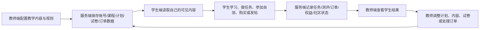
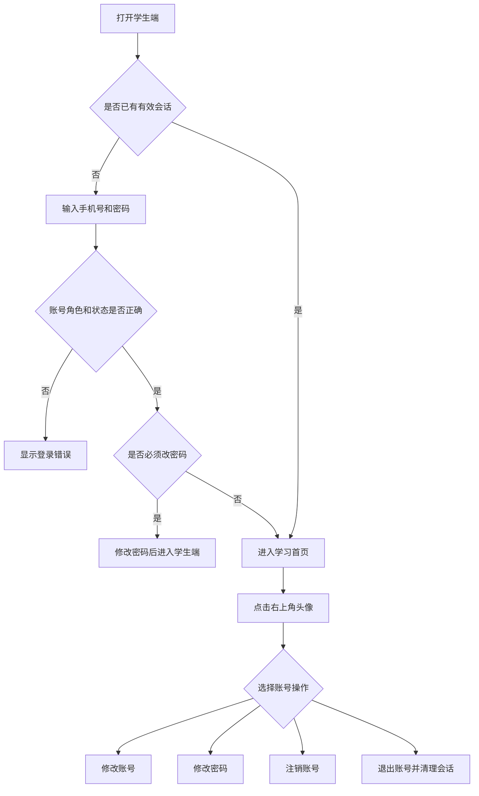
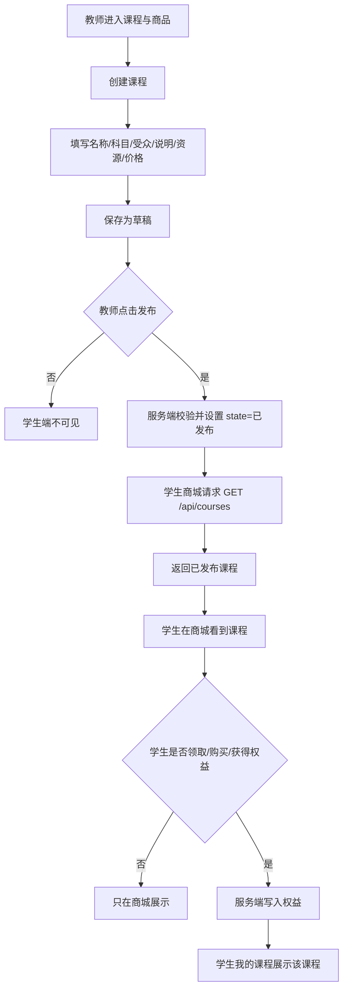
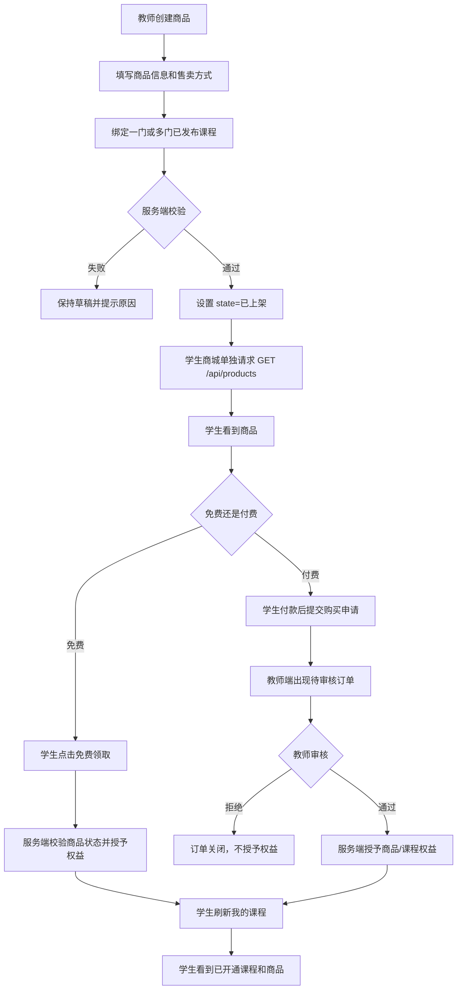
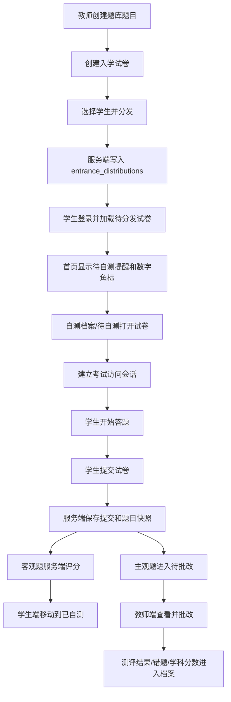
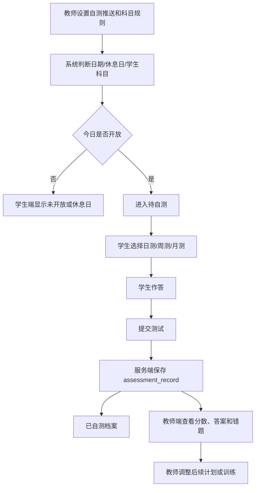
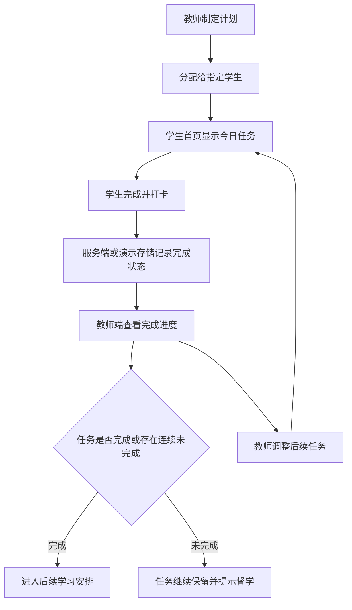
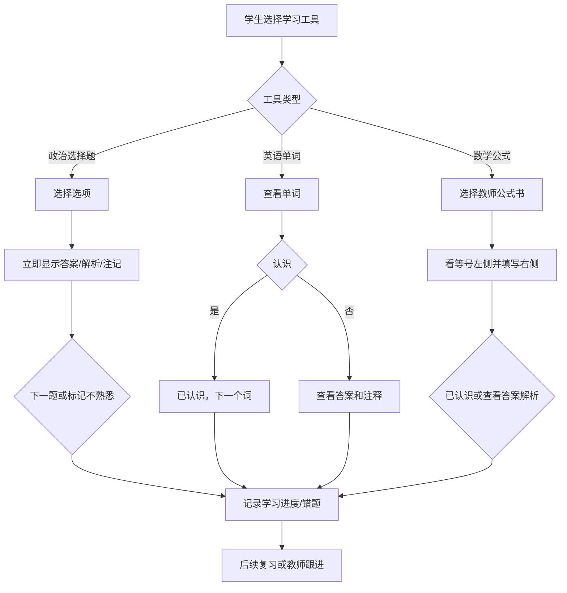
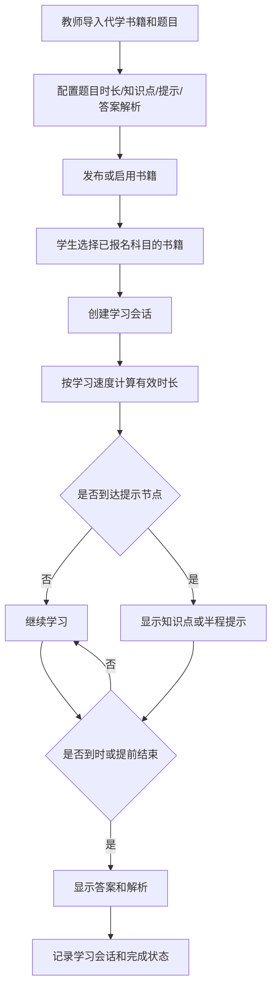
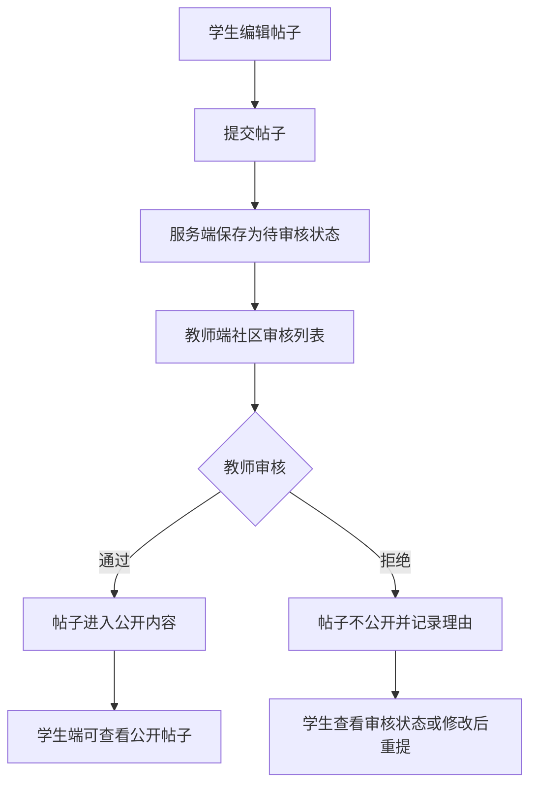

# 考研督学平台双端功能逻辑与协同流程说明

> 版本：2026-09-01  
> 说明：本文按照当前项目代码、数据库接口和页面结构整理。文中“已实现”表示项目中已有对应代码或接口；“待接入/待验收”表示还需要真实 PostgreSQL、对象存储、支付、AI 服务或浏览器端到端环境验证。

## 一、平台整体定位

考研督学平台由学生端和教师端组成。学生端负责学习、完成任务、参加自测、购买或领取课程、提交学习反馈；教师端负责建立学习内容、制定计划、分发试卷、查看学生表现、处理订单和管理平台配置。两端通过账号、课程权益、学习计划、任务完成记录、自测记录、错题记录、订单和通知进行协同。

平台的核心闭环是：

> 教师制定内容和要求 → 学生接收并执行 → 系统保存学习结果 → 教师查看结果并调整安排 → 学生继续按照新的安排学习。

## 二、学生端功能：学生可以做什么

### 1. 登录、注册和账号管理

学生可以从学生端入口使用手机号和密码登录。新学生可以按照开放注册规则注册账号；如果教师或管理员创建了学生账号，学生使用被分配的临时密码首次登录后，需要按照系统要求修改密码。

登录后，学生点击右上角头像，可以打开账号菜单。菜单包括“修改账号”“修改密码”“注销账号”和“退出账号”。“退出账号”用于结束当前登录会话；“修改密码”用于主动更换密码；“修改账号”用于维护允许学生本人修改的账号资料；“注销账号”用于发起账号注销操作，正式生产环境应按照平台的审核、数据保留和身份确认规则执行。

当前服务端已经具备登录、退出、主动改密和账号状态检查基础；账号资料编辑、注销账号的完整学生端弹窗和服务端闭环仍需在正式部署前继续验收，不能把菜单入口等同于完整业务已验收。

### 2. 学习首页

学生进入学习首页后，可以看到自己的学习概况、当前学习计划、今日任务和学习提醒。

首页会重点提示当天尚未完成的自测事项，包括教师分发的入学摸底试卷，以及当前开放的日测、周测、月测。待完成数量会显示在首页提醒区域，并同步显示在左侧“自测档案”导航旁的红色数字角标中。

学生可以从首页直接进入“待自测”，也可以进入今日任务、未来 7 天安排、学习计划和其他学习模块。

### 3. 我的课程

“我的课程”只展示学生已经获得学习权益的课程，不等于商城中的全部课程。

学生在商城免费领取课程、购买商品且订单被教师确认、或者被系统授予课程权益后，对应课程才会进入“我的课程”。学生可以查看课程名称、科目、分类、课程说明、视频和配套资料。课程是否出现在这里，取决于学生是否拥有对应权益，而不是教师是否已经在商城发布。

### 4. 商城

商城展示教师已经发布的课程和已经上架的商品。

课程必须处于“已发布”状态，学生才可以在商城看到；商品必须处于“已上架”状态，学生才可以看到。商品上架前还必须绑定至少一门已经发布的课程，服务端会再次校验商品状态、价格和绑定课程，前端显示不能替代服务端校验。

学生可以进行以下操作：

- 查看公开课程和可售商品的名称、分类、说明、价格及配套资料。
- 免费领取免费课程或免费商品。
- 对付费商品打开收款码，完成线下付款后提交购买申请。
- 查看已经开通的内容，并进入“我的课程”学习。
- 如果已经提交过待确认订单，系统会提示不要重复提交。

商城中的“看得到”与“已经拥有”是两个阶段：教师发布或上架后，学生可以在商城看到；学生领取、购买并完成订单处理后，相关课程才会出现在“我的课程”。

### 5. 学习计划和任务

学生可以查看教师为自己安排的学习计划，按照日期查看当天任务，也可以查看未来 7 天内的安排。

学生完成任务后，可以进行打卡或勾选完成。系统会记录任务完成状态、完成时间以及部分反馈信息。在 API 模式下，核心任务完成操作会提交到服务端；在本地演示模式下，部分学习进度仍使用浏览器本地数据保存。

当前任务进度的基本逻辑是：当天显示当前尚未完成的任务；如果当天任务没有完成，未完成内容会继续保留；当天整行任务完成后，学习进度才进入下一行。学生的完成反馈可以触发后续计划调整建议，但涉及自动调整的内容需要遵守教师确认规则。

### 6. 自测档案

“自测档案”分为“待自测”和“已自测”两部分。

“待自测”包括教师分发给当前学生且尚未提交的入学摸底试卷，以及当前日期已经开放、学生已经报名科目对应的日测、周测和月测。学生可以直接点击待自测卡片进入作答。

“已自测”用于归档已经提交的入学测评和日测、周测、月测记录。记录可以包含测试类型、科目、分数、总分、提交时间、批改时间和错题信息。API 模式下，学生登录或刷新后会从服务端重新加载自测记录，避免提交后因刷新丢失。

### 7. 入学摸底测评

学生可以在“待自测”中打开教师分发的入学摸底试卷，也可以通过有效的考试分享入口进入测评。

学生打开试卷后，系统会建立考试访问会话；学生开始考试后，在规定时间内完成作答并提交。客观题由服务端按照题目快照和标准答案进行评分；主观题可以保留为待批改状态，等待教师复核。提交后，试卷从“待自测”移动到“已自测”，相关结果进入学生的测评档案。

### 8. 日测、周测和月测

学生可以按照教师设置的推送规则参加日测、周测和月测。测试仅在对应开放时间、学生已报名科目和相关功能启用时可开始；如果当天是学生设置的休息日，系统会提示当天暂停测试。

学生作答并提交后，系统记录测试类型、科目、分数、答案、错题和用时等信息，并将结果归档。当前项目中周期测试题目和评分逻辑仍有浏览器端固定题库演示部分；真实 AI 出题、AI 批改和正式 Provider 执行器尚未完成，不能将现有入口描述为已经接入真实 AI 自动出题。

### 9. 练习与自测

学生可以进入普通练习、政治选择题、英语选择题等题目练习入口。题目练习用于巩固知识和检验掌握情况；完成后的错题或薄弱点可以进入错题复习范围，具体是否写入服务端取决于当前模块的 API 接入状态。

政治选择题的交互逻辑是：学生选择一个选项后，页面直接在下方显示正确答案、解析和注记，并提供继续下一题或标记为不熟悉的操作。标记为不熟悉的题目可以在后续复习中再次出现。

### 10. 学习工具

学生端的学习工具包括英语背单词、英语选择题、数学公式、数学练习和题目辅导等入口。

英语背单词的逻辑是：显示一个单词，学生点击“已认识，下一个词”后立即进入下一个单词；如果不认识，点击“查看答案和注释”，页面显示释义、答案和注释，然后进入后续复习流程。当前界面不再设置“暂不掌握下一个词”这一独立按钮。

数学公式采用教师上传的“书”组织。学生先选择公式书，再看到等号左侧的数学表达式，在输入框中填写等号右侧。页面只保留“已认识，下一个公式”和“查看答案和解析”两个主要操作；数学表达式使用规范的公式渲染方式显示，不以难以阅读的原始字符堆叠展示。

题目辅导用于提交或描述不会做的题目，系统按步骤给出辅导结果。涉及图片题时，需要真实视觉模型或服务端图像处理能力；仅有文本模型时不能保证正确识别题目图片。

### 11. 代学

“代学”是独立的核心导航功能，不放在普通学习工具卡片中。

学生可以选择自己已报名科目下、教师已经发布且对自己开放的代学书籍，进入计时学习会话。系统按书籍题目设置的时长推进学习，并在规定时间节点显示知识点提示、半程提示以及到时后的答案和解析。不同学习速度会影响有效学习时长。当前代学题库与知识库保持独立。

### 12. 学习社区

学生可以浏览社区内容、发布帖子、添加标签和附件，并查看帖子审核后的状态。帖子发布后会进入教师端或管理端的社区审核流程；教师审核通过后，内容才适合公开展示，具体公开状态以服务端审核结果为准。

### 13. 错题和复习记录

学生可以查看自测或练习产生的错题，按照知识点和题目进行复习，并对已经复习的错题进行标记。入学测评和部分自测提交会把错题归档到服务端，供学生后续复习和教师跟进。

## 三、老师端功能：老师可以做什么

### 1. 登录和账号权限

教师从教师端入口登录。教师账号可以管理自己权限范围内的学员、课程、商品、计划、题库、试卷和社区内容；平台管理员拥有更高权限，可以管理系统账号、AI Provider、监管机器人、审计日志等。

后端会根据账号角色进行权限校验。前端隐藏按钮只是界面体验，不能作为真正的安全边界。

### 2. 数据看板和工作台

教师可以从工作台或数据看板查看平台概况、学员情况、课程内容、订单、学习计划和自测相关信息。数据看板当前主要为前端聚合和基础展示，完整服务端 dashboard、风险学员聚合、队列状态和告警查询仍需要进一步补齐。

### 3. 学员管理

教师可以创建学员、导入学员、编辑学员档案、设置报考科目、设置目标院校和专业、维护学员状态，并查看学员的学习计划、任务完成情况、自测记录和错题情况。

教师可以停用或恢复学员账号，也可以重置学生密码。批量导入时，服务端会校验手机号、重复数据和字段合法性；如果批次中存在无效数据，正式 API 模式下应按事务规则整体回滚，避免只导入一部分。

### 4. 课程与内容管理

教师可以创建课程，填写课程名称、学科、受众、分类、课程说明、价格、视频和配套资料。课程初始通常为草稿状态。

教师点击“发布课程”后，课程状态变为“已发布”，学生商城可以读取到该课程。教师取消发布后，课程不再出现在学生商城；已经获得权益的学生是否继续保留学习权，需要按照平台具体权益和下架策略执行。

课程发布与商城展示的基本链路是：

> 教师创建课程 → 完善课程信息和资源 → 发布课程 → 服务端保存“已发布” → 学生商城读取并展示。

### 5. 商品与订单管理

教师可以创建商品，填写商品名称、分类、售卖方式、价格、说明、商品资料，并把商品绑定到一门或多门课程。

商品只有在满足绑定课程、价格和售卖方式等校验后，才能切换为“已上架”。商品状态为“已上架”时，学生商城可以读取并展示；商品下架后，学生端不再展示新的购买入口。

教师可以查看学生提交的购买申请，并进行订单审核。审核通过后，服务端按照订单中的商品绑定关系授予学生课程或商品权益；审核拒绝后，学生不会获得对应权益。订单金额和商品状态由服务端重新判断，不能只相信浏览器提交的数据。

商品发布与学生学习权益的基本链路是：

> 教师创建课程并发布 → 创建商品并绑定已发布课程 → 商品上架 → 学生商城看到商品 → 学生领取或提交订单 → 教师审核订单 → 服务端授予权益 → 学生“我的课程”出现对应课程。

### 6. 复习规划和计划分发

教师可以为学生制定复习计划，配置日期、科目、任务、学习内容、完成要求和计划开始日期，并将计划分配给指定学生。

计划分发后，学生端会在学习首页、学习计划和今日任务中看到自己的安排。教师修改计划或调整后续任务后，学生端在下一次加载或刷新后读取最新数据。计划进度、任务结构、附件和自动调整历史仍有部分功能处于逐步服务端化阶段，正式环境需要继续验证刷新后数据是否完整保留。

### 7. 题库和试卷

教师可以维护题库、创建试卷、配置题目、答案、解析、题型、分值和考试时间。

入学测评使用题目快照机制，分发后保留当时的题目内容和评分依据，避免教师后来修改题库导致已发试卷内容发生变化。教师可以选择学生并分发试卷，系统生成与学生绑定的分发记录和考试访问令牌。

### 8. 入学测评管理

教师可以查看入学测评试卷、分发记录、学生开始状态、交卷状态和评分结果。学生完成提交后，教师可以查看客观题得分、主观题待批改内容、错题和学科分数。

学生端待自测列表读取的就是教师分发记录中当前学生尚未提交的部分。教师撤销或结束试卷后，学生端不应继续把该试卷作为可作答项目展示。

### 9. 日测、周测、月测和 AI 相关配置

教师可以设置学生自测推送开关、日测、周测和月测的开放策略，并查看学生提交的自测档案。

平台还预留了周期自测、入学批改、计划助手、学习报告、题目辅导等监管机器人或 AI 能力配置。当前服务端已经具备机器人注册信息和 AI 任务持久化基础，但真实 Provider 调用、结构化输出校验、重试、成本统计和执行器尚未完成。教师端看到“已配置”时，应理解为配置展示或任务基础，不应理解为真实 AI 已经自动执行。

### 10. 书籍、普通题库和代学后台

教师可以维护普通练习书、英语单词书、政治题库、数学公式书和代学书籍。数学公式书由教师上传公式左侧、答案右侧、解析、注记等内容，学生端按书籍形式读取。

代学后台可以导入书籍和题目，并配置每道题的独立学习时长、知识点、半程提示、答案和解析。教师发布或启用代学书籍后，符合科目和权限条件的学生才可以看到对应书籍。

### 11. 知识库

教师可以上传和管理教学资料、知识库内容以及相关分类。知识库是资料检索和教学内容管理体系，当前与代学题库保持独立，不能默认认为上传到知识库的内容会自动进入代学题库。

### 12. 社区审核

教师可以查看学生提交的社区帖子，对帖子进行审核、通过或拒绝，并填写审核理由。审核结果会影响学生端可见状态。

### 13. 监管机器人和系统设置

平台管理员或有权限的教师可以查看监管机器人配置、模型名称、系统提示词、限制词、工具白名单和人工审批要求。系统设置还包括账号管理、密码重置、审计日志等功能。

敏感模型密钥不应保存到浏览器或写入源码；当前系统的真实 AI Provider、工具执行器、统一权限等级和完整调用审计仍需要正式服务端接入。

## 四、双端协同：学生做了什么，老师端会怎么样

### 1. 学生登录或退出

学生登录后，系统建立学生会话，教师端可以在学员管理中看到该账号的登录状态或最近活动信息（以当前服务端记录范围为准）。学生退出后，会话 Cookie 被清理，后续业务请求不能继续使用该学生身份。

### 2. 学生完成今日任务

学生勾选任务后，任务完成记录提交到服务端或本地演示数据。教师查看该学生计划时，可以看到对应任务的完成状态；如果学生撤销勾选，教师端对应状态也应恢复为未完成。连续未完成的任务会继续影响学生首页和后续督学判断。

### 3. 学生提交日测、周测或月测

学生提交自测后，测评记录写入服务端测评档案。教师端可以查看该学生的测试类型、科目、得分、总分、提交时间和错题情况。学生提交后，该项目从学生端“待自测”移动到“已自测”。

### 4. 学生提交入学摸底试卷

学生开始、提交入学试卷后，教师端可以查看分发状态、开始时间、交卷时间、客观题评分和待批改内容。学生端不再显示该试卷为待自测，教师端可以继续批改主观题或查看测评结果。

### 5. 学生领取免费课程或商品

学生点击免费领取后，服务端验证商品仍为“已上架”、价格和绑定课程仍然有效。验证通过后，学生获得相应权益，教师端可以在订单或权益相关信息中看到领取记录；学生刷新“我的课程”后可以看到对应课程。

### 6. 学生提交付费购买申请

学生提交购买申请后，教师端订单列表出现待审核订单。教师可以查看学生、商品、金额、提交时间和订单状态。教师审核通过后，服务端授予权益，学生重新加载后会在“我的课程”看到课程；教师拒绝后，学生不会获得该课程权益。

### 7. 学生发帖

学生发布帖子后，帖子进入教师端社区审核列表。教师审核通过后，帖子可以进入公开社区；教师拒绝后，学生端应显示相应的审核状态或不公开展示。

### 8. 学生复习错题

学生完成自测或题目练习后产生的错题，在已经接入服务端的模块中会写入错题归档。教师查看学生档案时可以据此了解薄弱知识点，并调整后续计划、题目或测试安排。

### 9. 学生使用代学和学习工具

学生在代学、单词、公式和题目辅导中的学习行为可以用于学生自己的学习进度和复习记录；教师端能否实时看到每一项工具行为，取决于该模块是否已经接入对应的服务端学习事件和统计接口。当前不能把所有浏览器端工具点击都描述为教师端实时可见。

## 五、双端协同：老师做了什么，学生端会怎么样

### 1. 教师发布课程

课程状态从草稿变为“已发布”。学生商城通过课程接口读取“已发布”课程，并展示课程卡片。学生只是在商城看到课程时，还没有获得“我的课程”权益；领取、购买或被授权后才进入“我的课程”。

### 2. 教师下架课程

课程状态不再是“已发布”，学生商城不再展示该课程的新购买或领取入口。已经获得权益的学生是否继续学习，应由服务端权益策略决定，教师不能仅凭前端列表判断历史权益是否被撤销。

### 3. 教师创建并上架商品

教师先创建商品、绑定已发布课程并设置合法售卖方式，再把商品状态改为“已上架”。学生商城会单独读取商品接口；已打开的学生商城会定时刷新课程和商品目录，因此教师上架后不必依赖学生整页刷新才能看到商品，但实际部署后仍应通过真实浏览器验证缓存、反向代理和登录权限。

### 4. 教师下架商品

商品不再以“已上架”状态返回学生端，学生商城不再显示新的购买按钮。历史订单和已经获得的权益由服务端保留并按订单、权益规则处理。

### 5. 教师审核订单通过

服务端确认订单后授予学生商品或课程权益。学生刷新或重新进入“我的课程”时，服务端返回新的权益，已购买商品会显示在已购内容区域，绑定课程会显示在课程列表中。

### 6. 教师审核订单拒绝

订单状态变为拒绝或关闭状态，学生不会获得相应权益。学生可以在订单提示中看到处理结果；如需再次购买，应按照当前商品状态重新提交申请。

### 7. 教师分发入学试卷

教师选定试卷和学生后提交分发。服务端生成学生专属分发记录。学生登录后，学生首页显示待自测提醒，“自测档案”出现红色数字角标，“待自测”列表显示该试卷，学生可以直接开始作答。

### 8. 教师调整或撤回入学试卷

教师撤回、结束或标记试卷已提交后，该试卷不应继续出现在学生端待自测列表。学生已经提交的结果仍进入已自测档案，教师可以继续查看和批改。

### 9. 教师设置日测、周测、月测

教师设置启用状态和开放规则后，符合学生科目、日期和推送条件的测试会出现在学生端待自测区域。当天可做的测试会计入首页待办数量；休息日或未到开放时间的测试不会作为可开始项目。

### 10. 教师分配学习计划

教师把计划模板或具体任务分配给学生后，学生首页、学习计划和今日任务出现新的安排。学生完成任务后，教师端可以查看进度并决定是否调整后续计划。

### 11. 教师发布代学书籍或公式书

教师发布或启用书籍后，符合科目和权限条件的学生可以在代学或数学公式工具中选择该书。教师修改书籍内容后，正式 API 模式应以服务端数据为准；已经开始的学习会话是否使用旧版本，需要由服务端版本和会话规则决定。

### 12. 教师审核社区内容

教师通过帖子后，学生端可以看到公开内容；教师拒绝后，帖子不应作为公开内容展示。审核理由可以用于学生查看修改方向。

## 六、关键业务流程图

### 1. 平台整体协同流程

### 2. 学生登录与账号操作流程

### 3. 教师发布课程、学生看到课程流程

### 4. 商品上架、订单审核、课程开通流程

### 5. 教师分发入学试卷、学生完成测评流程

### 6. 日测、周测、月测流程

### 7. 学习计划、任务打卡和教师跟进流程

### 8. 学习工具和错题复习流程

### 9. 代学计时学习流程

### 10. 社区发帖与审核流程

## 七、当前版本必须向部署人员说明的边界

### 1. 生产环境依赖

正式部署需要 PostgreSQL、正式域名和 HTTPS、正确的 `APP_ORIGIN`、安全的 `SESSION_SECRET`、对象存储或可用的文件存储方案，以及按项目文档配置的环境变量。仅完成前端构建不能等同于生产部署完成。

### 2. AI 功能边界

当前项目具备部分 AI 机器人配置、AI 任务基础和前端入口，但真实 Provider 调用、统一执行器、结构化结果校验、人工审核流和成本记录仍未完成。不能向部署人员承诺周期自测、题目辅导或学习报告已经由真实 AI 自动生成。

### 3. 文件和资料边界

当前 Storage adapter 以本地驱动为主，正式生产仍建议接入 S3-compatible、OSS、COS、R2 或 MinIO 等对象存储，并补齐 MIME 检测、病毒扫描、上传 ticket、对象权限和下载审计。

### 4. 数据持久化边界

课程、商品、订单、权益、考试分发、考试提交和部分计划、自测数据已经有服务端接口。部分学习进度、分类、偏好或历史仍可能使用浏览器本地数据，部署后应重点测试“教师修改 → 学生刷新/重新登录”和“学生提交 → 教师刷新/重新登录”两类持久化链路。

### 5. 建议部署后优先验收的真实路径

部署人员应使用一个真实教师账号和一个真实学生账号，依次验证：教师创建并发布课程；学生商城看到课程；教师创建绑定已发布课程的商品并上架；学生商城看到商品；学生免费领取或提交付费订单；教师审核订单；学生重新登录后“我的课程”出现权益；教师分发入学试卷；学生首页出现待自测数字提醒；学生提交后进入已自测；教师端可以看到测评结果。

## 八、功能状态说明

- “已实现”：代码和接口已经具备，仍应在部署环境进行浏览器和数据库联调。
- “演示/本地模式”：功能可以在本地演示，但数据可能保存在浏览器本地，不能作为多设备生产数据依据。
- “待验收”：已有实现基础，但尚未在真实 PostgreSQL、HTTPS、对象存储或浏览器环境完成完整验收。
- “待接入”：只有配置、页面或接口基础，真正的外部服务能力尚未完成。

本文不把“页面上有按钮”当作“业务闭环已经完成”，也不把“前端构建通过”当作“生产环境已经验收”。
